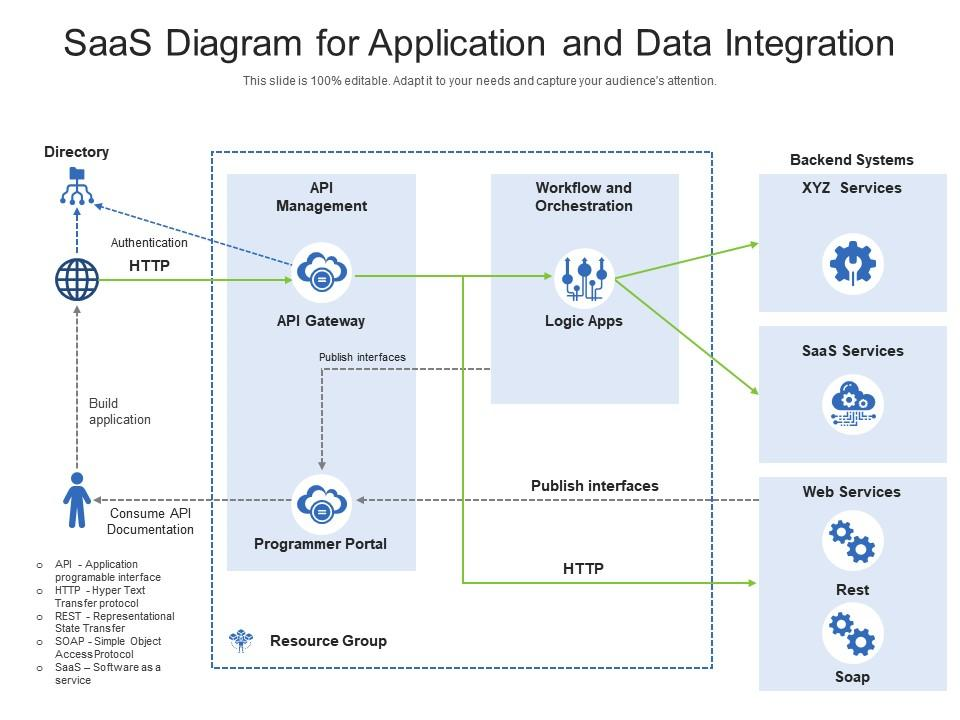

# SaaS Security Management System



## Overview
This SaaS Security Management System is designed to integrate with various SaaS applications, collect and store security data, analyze compliance, generate visual reports, and monitor for alerts. The system is built using Flask for the API and various Python modules for different functionalities.

## Features
- **API Integration**: Integrates with multiple SaaS platforms (Salesforce, ServiceNow, GitHub, DocuSign) to collect data.
- **Data Storage**: Stores collected data in an SQLite database.
- **Analysis and Compliance**: Analyzes the data for compliance and generates analysis results.
- **Visualization and Reporting**: Provides dashboard data and detailed reports.
- **Monitoring and Alerts**: Sets up real-time monitoring and alerts stakeholders of any issues.

## Modules
1. **`api_integration`**: Handles authentication and data collection from SaaS platforms.
2. **`data_storage`**: Responsible for storing data in an SQLite database.
3. **`analysis_compliance`**: Analyzes the data for compliance and performs detailed analysis.
4. **`visualization_reporting`**: Generates dashboard summaries and detailed reports.
5. **`monitoring_alerts`**: Sets up real-time monitoring and notifies stakeholders.

## Structure
```
project-root
│
├── main.py
├── modules
│   ├── api_integration.py
│   ├── data_storage.py
│   ├── analysis_compliance.py
│   ├── visualization_reporting.py
│   └── monitoring_alerts.py
```

## Installation
1. Clone the repository:
   ```
   git clone https://github.com/your-repository.git
   cd your-repository
   ```
2. Create a virtual environment and activate it:
   ```
   python3 -m venv venv
   source venv/bin/activate
   ```
3. Install the required Python packages:
   ```
   pip install -r requirements.txt
   ```

## Usage
1. Start the Flask application:
   ```
   python main.py
   ```
2. The API will be available at `http://0.0.0.0:5000`.

## Endpoints
- **POST** `/api/login`: User authentication.
- **GET** `/api/dashboard`: Retrieves dashboard data.
- **GET** `/api/analysis`: Retrieves analysis data.
- **GET** `/api/reports`: Retrieves report data.

## Dependencies
- Flask
- Flask-RESTful
- APScheduler
- sqlite3
- requests
- logging
- ObsidianSDK

## License
This project is licensed under the MIT License.

## Acknowledgements
Special thanks to the developers and open-source contributors who made this project possible.
